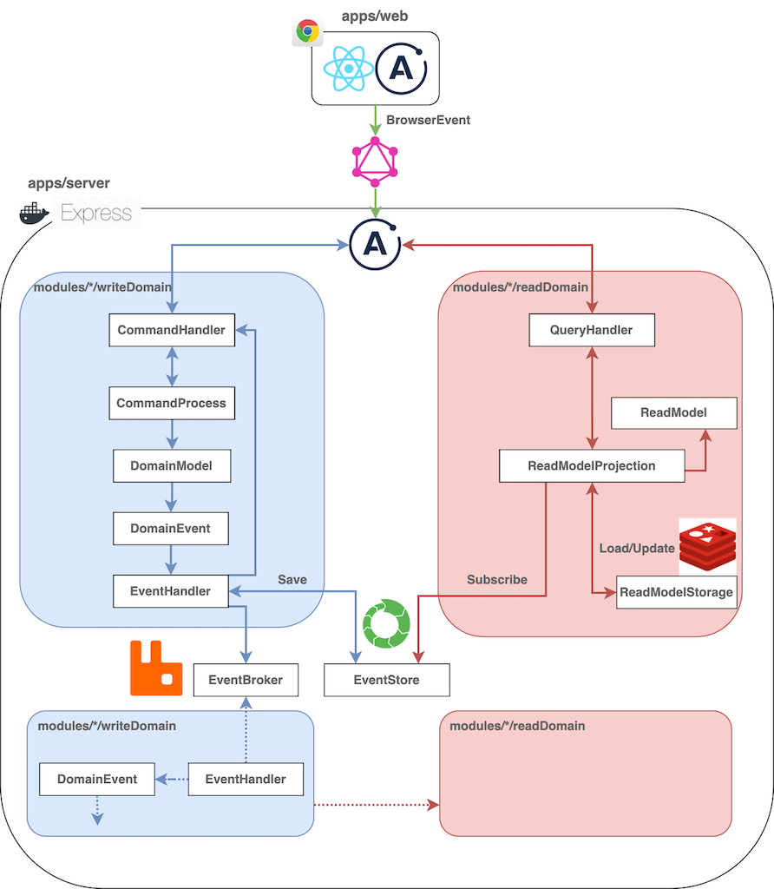

# ts-cqrs-eda-sample

This is sample code which adopt DDD architecture written by TS.

## How to run

WORK IN PROGRESS

## technologies

serverSide: Express(Node.js) 
frontSide: Next.js(React) 
storage: EventStoreDB, Redis 
messageBroker: RabbitMQ 
API: Apollo(GraphQL) 
others: yarnWorkspace, DockerCompose 

## Architecture Image

## Notice

This application is written to learn DDD.
Not suits for products.

The modules are integrated into an express server.
If you want to separate them and construct MicroService,
You can implement HTTP/gRPC server within each module.
And then you can convert express to a proxy or remove.

## Special Thanks

I have learned much about DDD in their books.

[Khalil Stemmler](https://khalilstemmler.com/) - [solid](https://solidbook.io/) 
[Alex Lawrence](https://www.alex-lawrence.com/) - [Implementing DDD, CQRS and Event Sourcing](https://www.alex-lawrence.com/book/)

## Special Thanks, For Japanese

日本語ソースでは以下の方々が非常に参考になります。

かとじゅんさん - [かとじゅんの技術日誌](https://blog.j5ik2o.me/) 
松岡さん - [little hand's lab](https://little-hands.hatenablog.com/) - [books](https://little-hands.booth.pm/) 
成瀬さん - [book](https://www.amazon.co.jp/dp/B082WXZVPC/)

